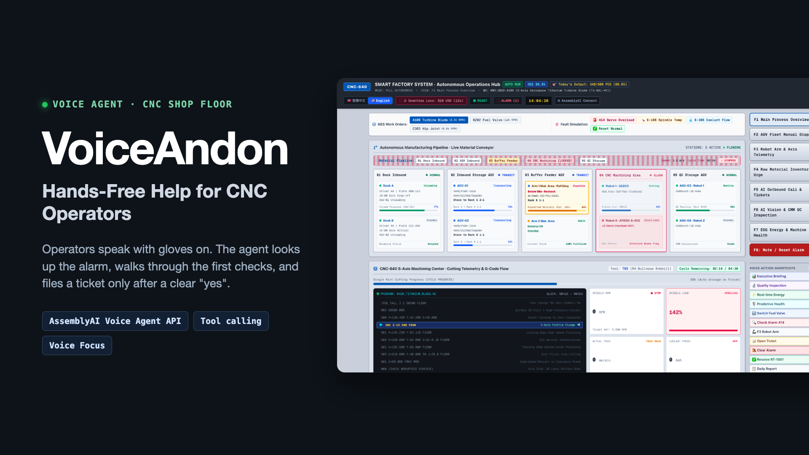

# VoiceAndon

**Hands-free voice help for CNC operators**, built on the [AssemblyAI Voice Agent API](https://www.assemblyai.com/docs) for the lablab.ai × AssemblyAI Voice Agent Hackathon (September 2026).

**Live demo:** <https://assembly-ai-sepia.vercel.app>



Operators talk to it right next to a loud machine. The agent checks the machine, looks up the alarm code, reads back likely causes and the first three checks, and files a repair ticket only after the operator clearly says "yes". Confirmed tickets appear instantly on the live work-order board.

## Try it (about 1 minute)

1. Open the live demo in desktop Chrome.
2. Click **AssemblyAI Connect** (top right) and allow the microphone. The demo passcode is pre-filled.
3. Speak English:
   - "Machine three has an alarm."
   - "What does alarm 414 mean?"
   - "I checked. It is still noisy. Please open a repair ticket." → the agent repeats the details → "Yes."
   - "Ticket RT-1001 is resolved."
4. Click **End** when you are done. Each session is limited to 5 minutes.

## How AssemblyAI is used

- **Voice Agent API** over WebSocket: speech-to-text, turn-taking, the language model and the spoken reply in one real-time connection.
- **Voice Focus** (far-field) noise suppression for loud machine floors.
- **JSON-Schema function tools** that run in the browser: `get_machine_status`, `lookup_alarm`, `get_maintenance_history`, `create_repair_ticket`, `resolve_repair_ticket`, `clear_machine_alarm`, `switch_console_view`, `end_conversation`. Deeper tools unlock only after the machine is confirmed.
- **Short-lived tokens** issued by our server, so the API key never reaches the browser.

## Design principles

- **Rescue first, ticket second** — help the operator fix simple problems before filing anything.
- **Never invents** — only numbers, codes and ticket IDs returned by a tool are spoken; unknown alarm codes get "I cannot find it".
- **Acts only on explicit confirmation** — no ticket without "yes". This is enforced in code, not just in the prompt: before filing a ticket or clearing an alarm, the browser checks that the operator's last words were a clear "yes" ([`src/voice/confirmGate.ts`](src/voice/confirmGate.ts)); otherwise the tool call is refused and the agent reads the details back again.
- **Never controls the machine** — voice reads and files; hands stay on the real controls.

## Roadmap: a safe path to machine actions

AI that acts on machines is where the industry is heading, so we plan to get there step by step, with a person in the loop:

1. **Today** — read machine data, advise, and file tickets only after the operator says "yes".
2. **Next** — low-risk actions (order material, schedule maintenance, notify a technician), each confirmed by a person.
3. **Then** — safe commands through the PLC, such as feed hold, with spoken confirmation and hardware safety interlocks. The emergency stop always stays in human hands.
4. **Later** — automatic handling of well-defined cases, fully logged and auditable.

## Demo data

All machines, alarm codes, maintenance records and tickets in this project are **fictional sample data** written for the demo. They are not copied from any manufacturer manual and do not describe any real machine, brand or company.

## Tech stack

- [Next.js](https://nextjs.org) 16 (App Router) with TypeScript
- [Tailwind CSS](https://tailwindcss.com) 4
- AssemblyAI Voice Agent API over WebSocket from the browser
- Deployed on [Vercel](https://vercel.com)

## Run it locally

Requirements: Node.js 20.9 or later.

```bash
npm install
cp .env.example .env.local   # set ASSEMBLYAI_API_KEY and DEMO_PASSCODE
npm run dev                  # http://localhost:3000
node scripts/mock-agent.mjs  # optional: free local mock agent on ws://localhost:8787
```

In development the console talks to the local mock agent, so you can test the UI without spending API credits. In production it connects to the AssemblyAI Voice Agent API. Use Chrome or Edge; the microphone only works on `localhost` or HTTPS.

## Project layout

| Path | What lives there |
| --- | --- |
| `src/app/page.tsx` | CNC-640 console (the main demo) |
| `src/app/pitch/` | 10-slide pitch deck (`/pitch`, printable to PDF) |
| `src/app/api/voice-token/` | Server route that checks the demo passcode and issues short-lived AssemblyAI tokens |
| `src/voice/` | Voice agent client: audio, WebSocket session, prompts, tool schemas |
| `src/tools/` | Tool handlers that read the demo data and create tickets |
| `src/console/` | Console commands and the simulated factory heartbeat |
| `src/data/` | Fictional demo data |
| `src/board/` | Work-order board components and ticket sync |
| `scripts/mock-agent.mjs` | Local mock of the voice agent for free testing |

## Security

- The AssemblyAI API key stays on the server in `.env.local`, which is never committed. The browser only receives a short-lived token.
- The token route requires the demo passcode, and every voice session is capped at 5 minutes.

## License

[MIT](LICENSE)
